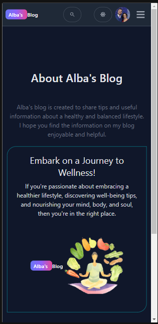
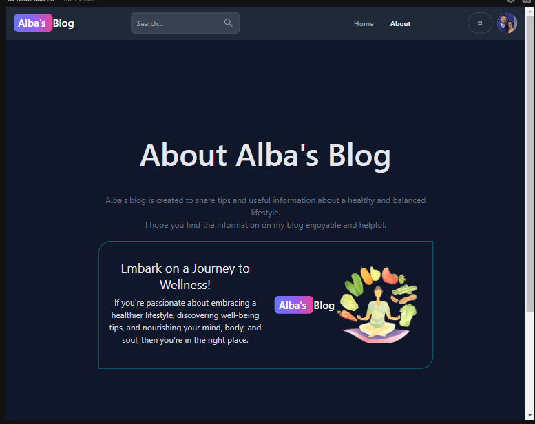
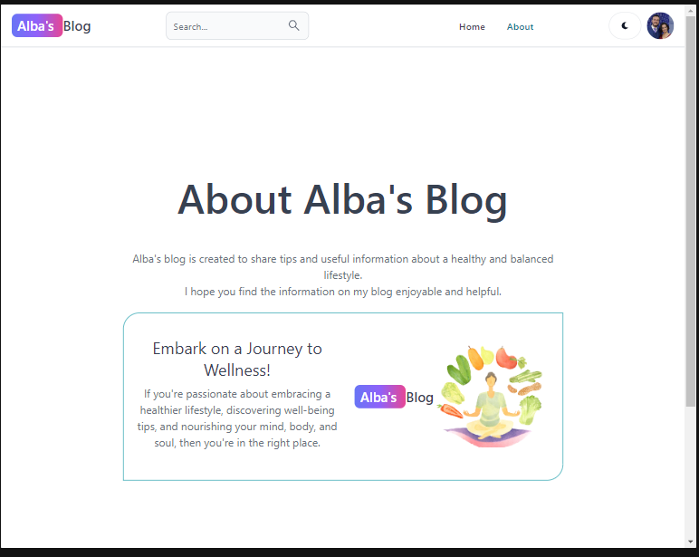
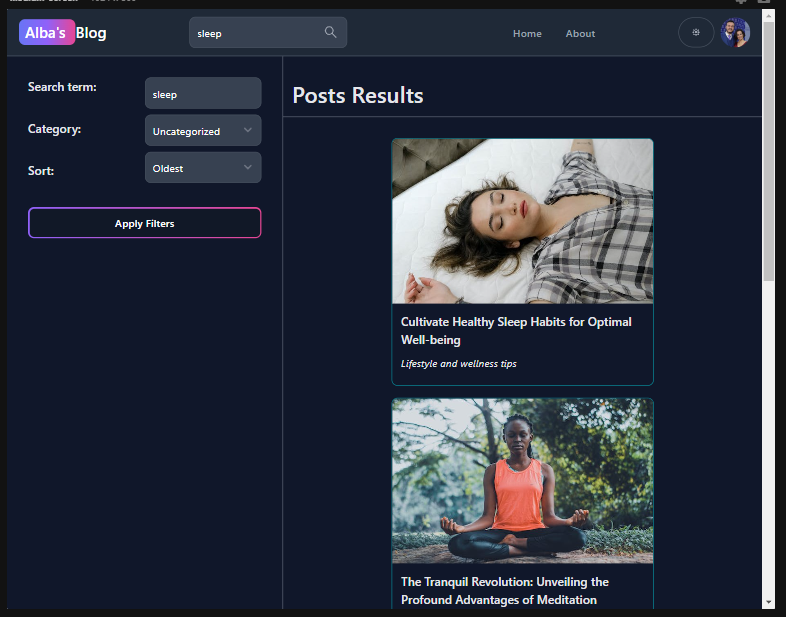
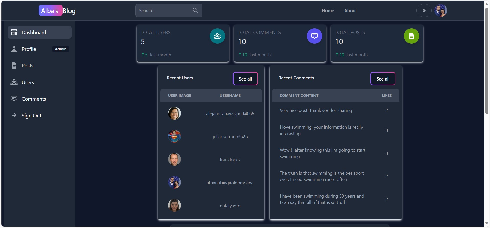

# 
<h1 align='center'>Alba's Blog</h1>

  

  
  

</a>

[Project Overview](#project-overview) •
[Key Features](#key-features) •
[Deployment](#deployment) •
[Contributing](#contributing) •
[License](#license) •
[Contributions](#contribution) •

---

##   Project Overview

Welcome to my latest project, a dynamic blog centered around promoting a healthy lifestyle. This endeavor serves as a comprehensive learning experience, allowing me to hone my skills and expand my knowledge across various technologies. Leveraging JavaScript, Node.js, React, Tailwind CSS, Firebase, and MongoDB, the blog showcases my proficiency in full-stack development. From crafting a responsive frontend with React and Tailwind CSS to managing data with MongoDB and Firebase, this project embodies a multifaceted approach to web development. The goal is not only to share insightful articles on healthy living but also to acquire hands-on expertise in integrating diverse tools seamlessly. Join me on this journey as we explore the intersection of technology and well-being. Let's embrace the challenges and opportunities that arise in creating a platform that inspires and informs.

---

##   Key Features

- Visually Attractive Design: Crafted for a visually engaging and pleasing user experience.

- Fully Responsive: Ensures seamless functionality across various devices for a consistent user experience.

-  Dark Mode: Allows users to toggle between light and dark modes for a personalized viewing experience.

Advanced Search Filters:

- Search by Categories: Users can filter posts by predefined categories.
- Keyword Search: Perform keyword searches to find specific articles.

Authentication:

- Email and Password: Users can register and log in using their email and password.
Google Authentication: Support for signing in with Google accounts.

User and Admin Modes:

User Mode:
- Commenting: Users can create, edit, delete comments and like posts.

Admin Mode:
- Blog Management: Create, edit, and delete blog posts.
Dashboard: Admin dashboard provides an overview of posts, comments, and users.

## Deployment

The project is deployed and accessible at https://mern-blog-mcbj.onrender.com/. in the results once you have them:

---

## Contributing

Contributions are welcome! Feel free to open issues or pull requests to help improve the project.

### License

This project is licensed under the MIT License.